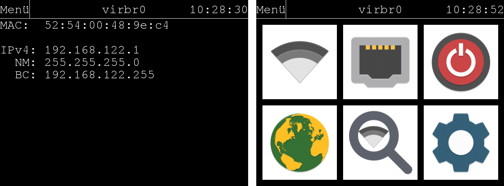

# c‘t-Net-Tester
A simple GUI-based network testing tool for the Raspberry Pi. Presented in c't 19/2018

[Papyrus Icons](https://github.com/PapirusDevelopmentTeam/papirus-icon-theme) licensed under GPL3 

[FreeMono](https://www.gnu.org/software/freefont/) licensed under GPL3

